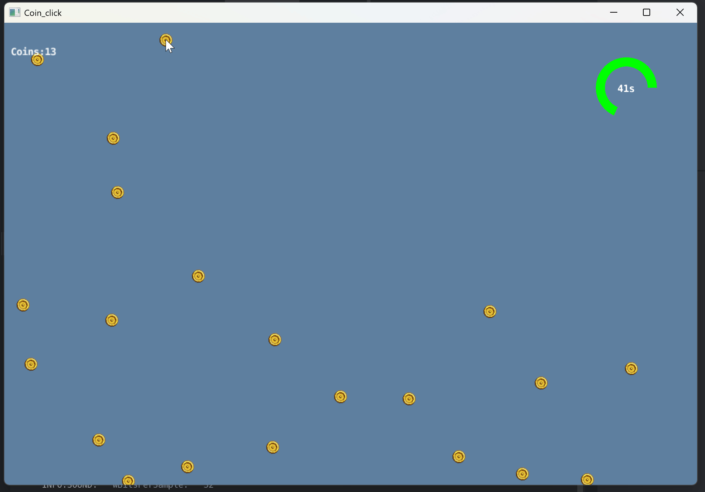

# Coin Clicker

A simple arcade-style clicking game built with **Defold** and **Lua**.

The objective is straightforward: **click all the randomly generated coins before the 60-second timer runs out.** The game was created as a learning project to become familiar with the Defold game engine, Lua scripting, and Defold's component-based architecture.

---

## Gameplay

At the start of each game:

- A random number of coins is generated.
- The countdown begins at **60 seconds**.
- Click every coin before time expires to win.
- If any coins remain when the timer reaches zero, the game ends in a loss.

The game focuses on practicing game logic, timers, object interaction, and simple user interface elements.

---

## Features

- Randomized coin generation
- 60-second countdown timer
- Mouse click interaction
- Win and lose conditions
- Sound effects for gameplay feedback
- Lightweight implementation using Defold and Lua

---

## Learning Objectives

This project was built to explore:

- Defold Engine fundamentals
- Lua scripting
- Game object messaging
- Factory-created game objects
- Collision and input handling
- Timers
- UI updates
- Basic game state management

---

## What I Learned

Through this project I became familiar with:

- Defold's game object and component system
- Lua scripting fundamentals
- Managing timers and countdown logic
- Handling player input
- Creating game objects with factories
- Managing game states (playing, win, and lose)
- Integrating sound effects and user interface updates


## Resources

### Timer Example

The countdown timer was adapted from Defold's repeating timer example. The original example was modified to count **down from 60 seconds** instead of counting upward.

https://defold.com/examples/timer/repeating_timer/

---

### Tutorial

This project was inspired by the Balloon Pop tutorial by Tactx Studios.

https://www.tactxstudios.com/_B_BalloonPop.html

---

## Assets

### Coin Artwork

**Gold Coin Token**

Created by **Bizmaster Studios**

https://opengameart.org/content/gold-cointoken

---

### Clock Sound

**Tick and Tock**

Created by **cemkalyoncu**

https://opengameart.org/content/tick-and-tock

---

### Coin Sound Effects

**Coins Sound Effects Library**

Created by **Little Robot Sound Factory**

https://opengameart.org/content/coins-sound-effects-library

---

### Win / Lose Sounds

**winsound_1** and **losemusic_1**

Created by **remaxim**

https://opengameart.org/users/remaxim

---

## Built With

- Defold Engine
- Lua

---

## Future Improvements

Possible enhancements include:

- Multiple difficulty levels
- Increasing coin spawn rates
- High-score tracking
- Animated coins
- Particle effects
- Mobile support
- Sound and music controls
- Pause and restart functionality

---

## Screenshot

> Add a gameplay screenshot or GIF here.

```

```

---

## License

This project is intended for educational and portfolio purposes.

Please refer to the original asset creators for the licenses associated with the artwork and audio resources used in this project.
